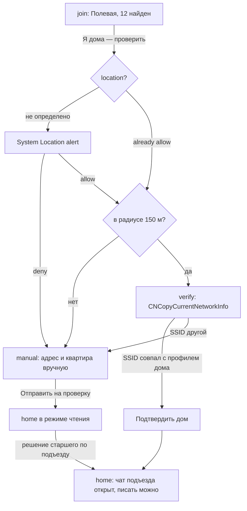
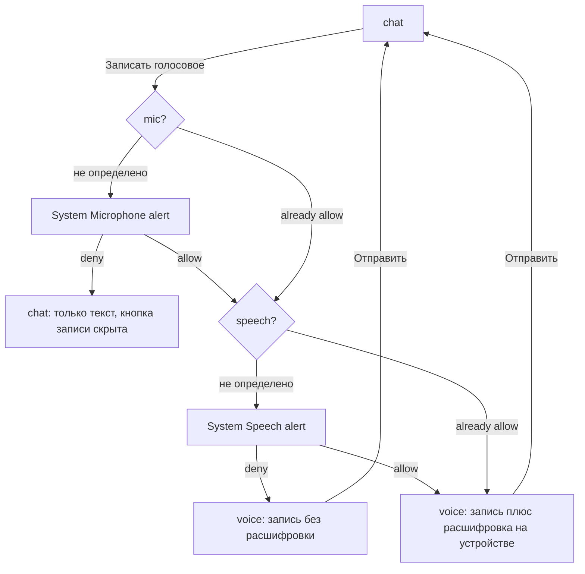
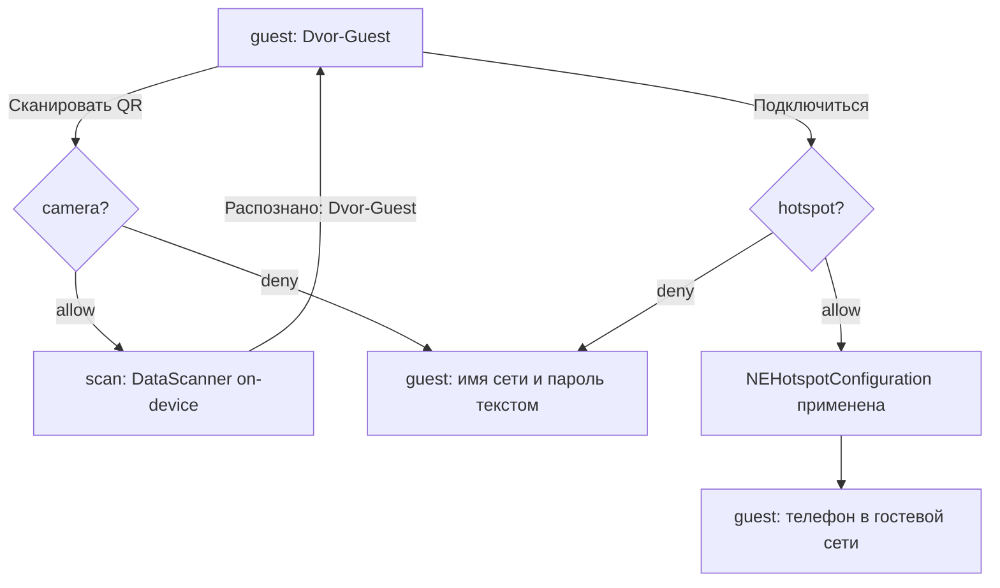
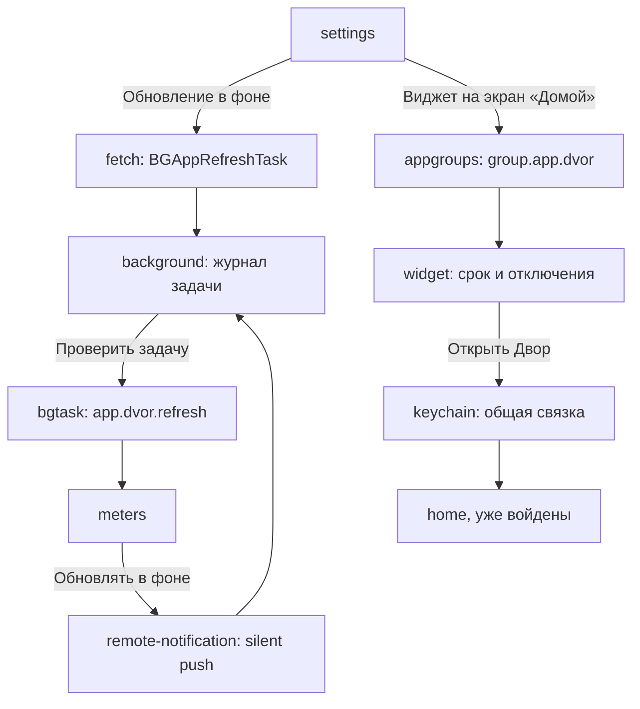

# В квартире — карта экранов и архитектура

Числа, которые должны совпадать во всех разделах: **20 заявленных ключей · 31 экран · 4 вкладки дока · 8 прототипов**.

Блоки `@generated:*` пересобираются командой `npm run docs -- dvor` из `concept.json` и разметки экранов — внутрь них руками не пишем.

---

## Модель домена

<!-- @generated:domain-model -->
| Сущность | Что это | Состояния | Экраны |
|---|---|---|---|
| Жилец | сосед по дому: имя, квартира и подъезд, без фото | приглашён → дом подтверждён | `neighbors`, `profile`, `join`, `verify` |
| Запись | своя запись о квартире: заявка, показания, голосовая заметка, фото поломки | черновик → отправлена в чат УК → закрыта | `home`, `post` |
| Заявка | проблема в доме: фото, голос, исполнитель | черновик → принята → в работе → закрыта | `problem`, `events`, `shoot`, `chat` |
| Событие дома | субботник, собрание, отключение | скоро → сегодня → прошло | `events`, `post`, `widget` |
| Показания | счётчики воды и электричества до срока | не переданы → переданы | `meters`, `scan` |
| Диалог | переписка с соседом или чат подъезда | есть непрочитанные → прочитан | `chats`, `chat`, `call` |
| Вызов домофона | звонок от калитки или двери подъезда | звонит → открыто → отклонён | `intercom` |
<!-- @end -->

## Сила доступов

<!-- @generated:access-strength -->
Сильных доступов: **16 из 20** (`npm run access -- dvor`).

| Ключ | Жест | Экран | Оценка |
|---|---|---|---|
| `location` ⚓ | «Я дома — проверить» | `join` | заслужен |
| `wifiinfo` ⚓ | «Продолжить» после сверки сети | `verify` | заслужен |
| `camera` | «Фото с места» в заявке | `problem` | заслужен |
| `photos` | «Собрать хронику» | `home` | заслужен |
| `push` | «Сообщить, когда закроют» | `post` | заслужен |
| `remotenotif` | Без жеста — фоновый режим | `meters` | нет trace: строка на экране, по которой видно, что режим отработал |
| `fetch` ⚓ | Без жеста — фоновый режим | `home` | нет trace: строка на экране, по которой видно, что режим отработал |
| `bgtask` | Без жеста — фоновый режим | `home` | нет trace: строка на экране, по которой видно, что режим отработал |
| `appgroups` | «Виджет на экран «Домой»» в настройках | `settings` | заслужен |
| `keychain` | «В квартире» из виджета | `widget` | заслужен |
| `autofill` | «Автозаполнение» в паролях дома | `passwords` | заслужен |
| `hotspot` | «Подключиться» | `guest` | заслужен |
| `contacts` ⚓ | «Найти среди контактов» в соседях | `neighbors` | заслужен |
| `calendar` | «В Календарь» у субботника | `events` | заслужен |
| `faceid` | «Замок Face ID» | `settings` | заслужен |
| `tracking` ⚓ | «Продолжить» | `ads` | после ATT реклама на экране не меняется |
| `mic` | «Добавить голосом» в заявке | `problem` | заслужен |
| `speech` | «Добавить голосом» в заявке — после микрофона | `problem` | заслужен |
| `commnotif` | «Доводчик, 3 подъезд» | `events` | заслужен |
| `voip` | «Позвонить» в шапке диалога | `chat` | заслужен |
<!-- @end -->

## Информационная архитектура

### Док из четырёх разделов

Холодный старт открывает **регистрацию по почте**: `phone` → `join`. OTP и подтверждения адреса нет. Дока и permission-алертов на регистрации нет: доступы начинаются после создания аккаунта и после того, как дом подтверждён.

### Стек навигации

Дерево ниже выведено из разметки экранов и `concept.json`, руками не правится: вложенность — по `parent`, подпись «открывается» — реальный элемент прототипа.

<!-- @generated:ia-tree -->
```
Вход по номеру (phone) — старт, без таб-бара · открывается: старт
    ├─ Пароль (password) — push, без таб-бара · открывается: «Далее»
    │   └─ Аккаунт (account) — push, без таб-бара · открывается: «Профиль и аккаунт»
    │       └─ Удаление аккаунта (deleteaccount) — push, без таб-бара · открывается: «Удалить аккаунт»
    ├─ Создать аккаунт (register) — push, без таб-бара · открывается: «Создать аккаунт»
    │   └─ Пароль нового аккаунта (registerpassword) — push, без таб-бара · открывается: «Далее»
    └─ Найдите свой дом (join) — push · открывается: «Продолжить без аккаунта», «Войти» … · location
        ├─ Проверка сети (verify) — modal · открывается: «Я дома — проверить» (location), «Мой дом» · wifiinfo
        └─ Адрес вручную (manual) — push · открывается: «Я дома — проверить» (location), «Моего дома нет в списке»

Дом (home) — tab (root) · открывается: «Продолжить» (wifiinfo), «Полевая, 12», «Полевая, 12к2» …, «Виджет «В квартире»», «В квартире» (keychain) · photos, fetch, bgtask
    ├─ Запись (post) — push · открывается: «Доводчик на второй двери», «Доводчик, та же дверь» · push
    ├─ Сообщить о проблеме (problem) — sheet · открывается: «Заявка с фото», «Сделать заявкой», «Снять» · camera, mic, speech
    │   └─ Камера (shoot) — системная поверхность · открывается: «Снять ещё» (camera), «Камера»
    ├─ Хроника квартиры (chronicle) — push · открывается: «Фото в хронику», «Трещина над ванной» …, «Собрать хронику» (photos)
    └─ Мессенджер (chats) — tab (root) · открывается: «Общие чаты»
        ├─ Диалог (chat) — push · открывается: «Диалог: Марина, кв. 63», «Написать» · voip
        │   └─ Звонок (call) — fullscreen · открывается: «Позвонить» (voip)
        ├─ Управляющая компания (ukchat) — push · открывается: «Чат УК», «Отправила в чат УК» …, «Доводчик, 3 подъезд» (commnotif)
        ├─ Диалог с Петром (chatpetr) — push · открывается: «Диалог: Пётр Ильин, кв. 66», «Написать»
        ├─ Диалог с Ириной (chatirina) — push · открывается: «Диалог: Ирина, кв. 78», «Написать»
        ├─ Диалог с Денисом (chatdenis) — push · открывается: «Диалог: Денис, кв. 79»
        ├─ Чат 3 подъезда (chatentr) — push · открывается: «Отправить в чат подъезда», «Диалог: 3 подъезд · 18 жильцов»
        ├─ Чат совета дома (chatsovet) — push · открывается: «Диалог: Совет дома · 6», «Собрание собственников»
        └─ Выбор фото (photopick) — push · открывается: «Фото»

Двор (yard) — tab (root) · открывается: «Схема двора»
    ├─ Домофон (intercom) — fullscreen · открывается: «Домофон»
    ├─ Гостевая сеть (guest) — push · открывается: «Гостевая сеть», «Подключиться» · hotspot
    │   └─ Сканер QR (scan) — системная поверхность · открывается: «Сканировать QR с лавочки»
    └─ Счётчики (meters) — push · открывается: «Показания», «Все счётчики» … · remotenotif

События дома (events) — tab (root) · открывается: «В Календарь», «Доводчик, 3 подъезд» … · calendar, commnotif
    └─ Черновик заявки (dictate) — sheet · открывается: «Добавить голосом» (mic + speech), «Черновик: в лифте не горит свет»

Меню (menu) — tab (root) · открывается: «Продолжить» (tracking)
    ├─ Пароли дома (passwords) — push · открывается: «Пароли дома» · autofill
    │   └─ Автозаполнение в Safari (fill) — системная поверхность · открывается: «Автозаполнение» (autofill)
    ├─ Соседи из контактов (neighbors) — push · открывается: «Новый диалог», «Соседи» · contacts
    │   ├─ Профиль соседа Марины (marina) — push · открывается: «Марина Кольцова»
    │   └─ Профиль соседа Ирины (irina) — push · открывается: «Ирина Тепляк»
    ├─ Профиль соседа (profile) — push · открывается: «Пётр Ильин», «Квартира 66» …
    └─ Настройки (settings) — push · открывается: «Настройки», «Анна Разумова» · appgroups, faceid
        ├─ Реклама (ads) — modal · открывается: «Настроить рекламу», «Реклама» · tracking
        ├─ Замок Face ID (lock) — системная поверхность · открывается: «Замок Face ID» (faceid)
        └─ Виджет на экране «Домой» (widget) — системная поверхность · открывается: «Виджет на экран «Домой»» (appgroups) · keychain
```
<!-- @end -->

### Модалки и sheets

`verify` — модалка, а не push: это не раздел, а результат проверки, и закрывается он либо подтверждением дома, либо возвратом на `join`.

### Правила IA

---

## Системные поверхности как отдельные экраны

Шесть поверхностей внутри своего приложения плюс седьмая — панель автозаполнения в чужом Safari. Все они нарисованы отдельными экранами не для красоты: **на своих экранах приложения результат entitlement'а не видно.** Ревьюер, который не увидел результат, читает entitlement как заявленный «про запас» — это 5.1.1 и 2.5.4.

### `shoot` — камера

`AVFoundation`, полноэкранный тёмный вид с подсказкой «снимите так, чтобы было видно дверь и доводчик». Зачем отдельным экраном: `NSCameraUsageDescription` защищается не текстом строки, а тем, что съёмка действительно ведёт к результату — тост «Кадр добавлен к заявке» возвращает в `problem`, где кадр приложен к заявке 4417-Б. Открывается с `problem`, отказ оставляет `problem` с фото из медиатеки.

### `scan` — сканер QR

`DataScannerViewController`, распознавание на устройстве. Второй триггер того же ключа камеры и отдельный экран, потому что сценарий другой: наводка на QR-код с лавочки у второго подъезда, результат «Распознано: Dvor-Guest» и возврат в `guest` с уже заполненными параметрами сети. Без этого экрана `hotspot` выглядел бы как настройка сети из ниоткуда.

### `lockscreen` — уведомление с аватаром

### `background` — журнал фоновой задачи

Доказательство сразу трёх ключей: `UIBackgroundModes: fetch`, `UIBackgroundModes: remote-notification` и `BGTaskSchedulerPermittedIdentifiers`. Экран показывает идентификатор `app.dvor.refresh`, режим `fetch + remote-notification`, время последнего запуска и журнал строками:

```
04:12  BGAppRefreshTask запущен системой
04:12  ответы УК: +2
04:13  срок показаний пересчитан: 25 апреля
04:13  снапшот виджета перезаписан
09:41  silent push: статус заявки 4417-Б
```

Журнал нужен потому, что фоновый режим по определению не наблюдаем в момент проверки: ревьюер не может дождаться, пока система запустит задачу. Кнопка «Проверить задачу» уводит на `meters`, где обе обновлённые строки — срок и показания — видны сразу.

### `lock` — замок Face ID

`LocalAuthentication`, политика `deviceOwnerAuthentication`. Отдельный экран, потому что `NSFaceIDUsageDescription` защищается ответом на вопрос «что именно вы прячете»: на экране написано — адрес, номера квартир и коды от общих дверей. Там же сказано, что распознавание делает система, приложение получает только «да» или «нет». Запасной путь — «Ввести код-пароль», он на том же экране.

### `widget` — виджет на экране «Домой»

Доказательство `com.apple.security.application-groups` и `keychain-access-groups` одновременно. На экране домашний экран iOS с виджетом «Двор · Полевая, 12», внутри — отключение горячей воды и срок показаний, ниже подписи: контейнер `group.app.dvor`, сессия — Keychain общей группы. Кнопка «Открыть Двор» активирует `keychain` и открывает `home` **уже войденным** — это и есть проверяемый результат общей связки ключей. Без обеих групп виджет был бы пустым, а вход пришлось бы повторять в каждом расширении.

### `fill` — панель автозаполнения в Safari

Доказательство `com.apple.developer.authentication-services.autofill-credential-provider`, и единственная поверхность **вне** приложения: страница `uk-polevaya.ru`, поле «Личный кабинет», подсказка над клавиатурой «Двор · 12-74» и вариант «Другой пароль». Подпись объясняет разделение ответственности: подсказку выдаёт расширение «В квартире», пароль остаётся в связке ключей, в поле его подставляет система. Экран светлый, в отличие от остальных поверхностей, — потому что Safari светлый; тёмная версия читалась бы как свой UI, а это чужой.

---

## Карта экранов

<!-- @generated:screen-map -->
| ID | Название | Тип | Доступы |
|---|---|---|---|
| `phone` | Вход по номеру | старт, без таб-бара | — |
| `password` | Пароль | push, без таб-бара | — |
| `register` | Создать аккаунт | push, без таб-бара | — |
| `registerpassword` | Пароль нового аккаунта | push, без таб-бара | — |
| `account` | Аккаунт | push, без таб-бара | — |
| `deleteaccount` | Удаление аккаунта | push, без таб-бара | — |
| `join` | Найдите свой дом | push | location |
| `verify` | Проверка сети | modal | wifiinfo (activate) |
| `manual` | Адрес вручную | push | — |
| `home` | Дом | tab (root) | photos, fetch (activate), bgtask (activate) |
| `post` | Запись | push | push |
| `problem` | Сообщить о проблеме | sheet | camera, mic, speech |
| `dictate` | Черновик заявки | sheet | — |
| `shoot` | Камера | системная поверхность | — |
| `chronicle` | Хроника квартиры | push | — |
| `chats` | Мессенджер | tab (root) | — |
| `chat` | Диалог | push | voip (activate) |
| `ukchat` | Управляющая компания | push | — |
| `call` | Звонок | fullscreen | — |
| `intercom` | Домофон | fullscreen | — |
| `yard` | Двор | tab (root) | — |
| `guest` | Гостевая сеть | push | hotspot |
| `scan` | Сканер QR | системная поверхность | — |
| `meters` | Счётчики | push | remotenotif (activate) |
| `events` | События дома | tab (root) | calendar, commnotif (activate) |
| `menu` | Меню | tab (root) | — |
| `passwords` | Пароли дома | push | autofill (activate) |
| `fill` | Автозаполнение в Safari | системная поверхность | — |
| `neighbors` | Соседи из контактов | push | contacts |
| `profile` | Профиль соседа | push | — |
| `settings` | Настройки | push | appgroups (activate), faceid |
| `ads` | Реклама | modal | tracking |
| `lock` | Замок Face ID | системная поверхность | — |
| `widget` | Виджет на экране «Домой» | системная поверхность | keychain (activate) |
| `marina` | Профиль соседа Марины | push | — |
| `irina` | Профиль соседа Ирины | push | — |
| `chatpetr` | Диалог с Петром | push | — |
| `chatirina` | Диалог с Ириной | push | — |
| `chatdenis` | Диалог с Денисом | push | — |
| `chatentr` | Чат 3 подъезда | push | — |
| `chatsovet` | Чат совета дома | push | — |
| `photopick` | Выбор фото | push | — |
<!-- @end -->

Колонка «Доступы» показывает экран, **с которого ключ запрашивается**, а не все экраны, где результат виден. Пометка `(activate)` — entitlement без системного алерта.

---

## Переходы: откуда куда и чем

Каждая строка — элемент, который есть в прототипе. Вкладки дока опущены: они ведут в корни разделов и одинаковы на всех экранах.

## Действия на экранах

Каждый интерактивный элемент прототипа: что он делает, куда ведёт и какой ключ при этом запрашивается. В отличие от таблицы переходов выше, вкладки таб-бара, кнопки возврата и подтверждения без перехода тоже здесь — раздел выводится из разметки и отвечает на вопрос «что делает эта кнопка», не заставляя открывать HTML.

Три строки в таблице читаются неочевидно: у них нет парной строки «отказ → fallback», потому что разрешение и отказ приводят на один и тот же экран.

- `post` → `post` по «Сообщить, когда закроют»: подписка на закрытие заявки включилась либо статус остаётся виден в записи — результат здесь же, уводить некуда.
- `guest` → `guest` по «Подключиться к Dvor-Guest»: подключение меняет состояние карточки сети, а не экран; при неудаче на её месте оказывается имя сети с паролем текстом.
- `events` → `events` по «Добавить субботник в Календарь»: событие либо ушло в системный календарь, либо осталось внутри «В квартире» с напоминанием в приложении — обе версии это одна и та же карточка события.

Ещё одна строка объясняется отдельно: `lock` → `menu` по «Разблокировать Двор по Face ID». Замок снимается не в тот раздел, откуда его включили, а в «Меню» — потому что в реальном приложении экран замка встречает при запуске, а не открывается из настроек. Запасной путь «Ввести код-пароль» ведёт назад в `settings`.

---

## Матрица доступов

Двадцать ключей набора: чем заслужен, каким жестом вызывается, что остаётся при отказе.

<!-- @generated:perm-matrix -->
| Ключ | Жест пользователя | Экран | Если отказ | Риск Review |
|---|---|---|---|---|
| `NSLocationWhenInUseUsageDescription` | «Я дома — проверить» | Найдите свой дом | Остаётся подтверждение адреса вручную — заявку смотрит старший по подъезду | **Условный** — CLLocationManager whenInUse: без него iOS не отдаёт имя текущей сети |
| `com.apple.developer.networking.wifi-info` | «Продолжить» после сверки сети | Проверка сети | Без entitlement подтверждение остаётся только ручным — не ship | **Условный** — CNCopyCurrentNetworkInfo плюс выданная геопозиция — иначе SSID приходит пустым |
| `NSCameraUsageDescription` | «Фото с места» в заявке | Сообщить о проблеме | Остаётся фото из медиатеки и ввод имени сети с паролем руками | Низкий |
| `NSPhotoLibraryUsageDescription` | «Собрать хронику» | Дом | В хронике остаются только кадры, снятые в приложении | Низкий |
| `aps-environment` | «Сообщить, когда закроют» | Запись | Статус виден в записи, ответ — в чате УК | **Условный** — регистрация в APNs через Firebase Cloud Messaging и отправка из консоли — своего сервера нет |
| `UIBackgroundModes: remote-notification` | Без жеста — фоновый режим | Счётчики | Без режима цифры обновляются только при открытии | **Условный** — обработчик didReceiveRemoteNotification, который переписывает снапшот виджета |
| `UIBackgroundModes: fetch` | Без жеста — фоновый режим | Дом | Без режима лента и срок обновляются в момент открытия | **Условный** — BGAppRefreshTask, который реально читает срок и ответы УК из Firestore |
| `BGTaskSchedulerPermittedIdentifiers` | Без жеста — фоновый режим | Дом | Сводка собирается при открытии | **Условный** — строка в Info.plist совпадает с BGTaskScheduler.register — иначе падение при регистрации |
| `com.apple.security.application-groups` | «Виджет на экран «Домой»» в настройках | Настройки | Без группы виджет пустой, а пересланный снимок не доходит — не ship | Низкий |
| `keychain-access-groups` | «В квартире» из виджета | Виджет на экране «Домой» | Без общей группы вход придётся повторять в каждом расширении | Низкий |
| `com.apple.developer.authentication-services.autofill-credential-provider` | «Автозаполнение» в паролях дома | Пароли дома | Пароль остаётся копировать руками из карточки | Низкий |
| `com.apple.developer.networking.HotspotConfiguration` | «Подключиться» | Гостевая сеть | Имя сети и пароль показываются текстом — вводится руками в Настройках | Низкий |
| `NSContactsUsageDescription` | «Найти среди контактов» в соседях | Соседи из контактов | Остаётся поиск по номеру квартиры и по подъезду | Средний |
| `NSCalendarsFullAccessUsageDescription` | «В Календарь» у субботника | События дома | Событие остаётся только внутри приложения, с напоминанием | Низкий |
| `NSFaceIDUsageDescription` | «Замок Face ID» | Настройки | Остаётся код-пароль устройства | Низкий |
| `NSUserTrackingUsageDescription` | «Продолжить» | Реклама | Реклама остаётся, но неперсонализированная — не по интересам | **Условный** — рекламный SDK в сборке, IDFA действительно уходит в SDK — иначе промпт нечем оправдать |
| `NSMicrophoneUsageDescription` | «Добавить голосом» в заявке | Сообщить о проблеме | Заявку можно заполнить текстом | Низкий |
| `NSSpeechRecognitionUsageDescription` | «Добавить голосом» в заявке — после микрофона | Сообщить о проблеме | Черновик можно заполнить с клавиатуры | Низкий |
| `com.apple.developer.usernotifications.communication` | «Доводчик, 3 подъезд» | События дома | Без entitlement статус заявки приходит обычным уведомлением | **Условный** — INSendMessageIntent только для ответа ответственного по заявке |
| `UIBackgroundModes: voip` | «Позвонить» в шапке диалога | Диалог | Остаются сообщения и голосовые | **Условный** — PushKit + CallKit и реальный WebRTC-сеанс только с панелью дома |
<!-- @end -->

## Обоснование доступов

Кто, когда и почему без доступа фича не работает — из `permissions[].rationale`.

<!-- @generated:access-rationale -->
| Ключ | Кто | Когда | Почему без доступа не работает | Что остаётся после отказа |
|---|---|---|---|---|
| `location` | Жилец, который впервые подтверждает свою квартиру | При входе нажимает «Я дома — проверить» | iOS отдаёт имя Wi-Fi сети только при разрешении на геопозицию, а пропуск в чат подъезда — это место плюс сеть | Адрес вручную: чат подъезда открывается после подтверждения соседом |
| `wifiinfo` | Жилец на экране «Проверка сети» | Сразу после геопозиции, при первом входе | Пропуск в чат подъезда сверяет имя домашней сети с записанной в профиле дома | Подтверждение кодом от соседа, остальное приложение работает |
| `camera` | Жилец, у которого в квартире что-то сломалось | Создаёт заявку и нажимает «Фото с места» | Мастеру и УК нужен кадр поломки, снятый сейчас, а не описание словами | Заявка уходит текстом и голосом, кадр можно взять из хроники |
| `photos` | Жилец, ведущий хронику своей квартиры | На главной нажимает «Собрать хронику» | Приложение само находит в медиатеке снимки, сделанные дома: счётчики, чеки, поломки — вручную их среди тысяч не найти | Хроника состоит из снятого в приложении |
| `push` | Жилец с открытой заявкой | В записи заявки включает «Сообщить, когда закроют» | Статус заявки меняется, пока приложение закрыто, — без пуша о закрытии не узнать вовремя | Статус виден в записи при открытии, ответ — в чате УК |
| `remotenotif` | Жилец, который передаёт показания | Без жеста: УК меняет срок или тариф | Тихий пуш обновляет срок показаний в ленте и виджете до открытия приложения | Срок обновляется в момент открытия |
| `fetch` | Жилец, который открывает приложение утром | Без жеста, к первому открытию | Срок показаний и новые ответы УК подтягиваются в фоне, лента квартиры готова сразу | Обновление в момент открытия, с задержкой |
| `bgtask` | Жилец, который открывает приложение утром | Ночью, пока телефон заряжается, без жеста | Без зарегистрированного идентификатора iOS не запустит утреннюю сводку квартиры | Сводка собирается при открытии |
| `appgroups` | Жилец с виджетом срока показаний | Добавляет виджет на экран «Домой» из настроек | Виджет читает срок и отключения только через общую группу приложения | Срок виден только внутри приложения |
| `keychain` | Жилец, который открывает приложение из виджета | Нажимает на виджет на экране «Домой» | Сессия лежит в общей связке ключей — иначе из виджета открывается экран входа | Повторный вход по номеру и паролю |
| `autofill` | Жилец, который заходит в кабинет УК в Safari | Открывает кабинет УК в Safari из «Паролей дома» | Лицевой счёт и пароль кабинета подставляются в Safari без копирования | Пароль копируется из приложения вручную |
| `hotspot` | Гость или жилец у лавочки с QR-кодом | Сканирует QR гостевой сети и нажимает «Подключиться» | Подключить телефон к Wi-Fi из приложения можно только через HotspotConfiguration | Имя сети и пароль показаны текстом |
| `contacts` | Жилец, который ищет соседей для чата подъезда | Нажимает «Найти среди контактов» в соседях | Кто из знакомых живёт в этом доме, видно только сверкой своей книги на устройстве | Соседи находятся по номеру квартиры |
| `calendar` | Жилец перед отключением воды или собранием | Нажимает «В Календарь» у события | Полный доступ нужен, чтобы перенести уже добавленное событие, когда УК сдвигает дату | Событие и напоминание остаются в приложении |
| `faceid` | Жилец, у которого в приложении коды и пароли дома | Включает «Замок Face ID» в настройках | Коды домофона, пароли и лицевой счёт не должны открываться с чужих рук | Замок по код-паролю устройства |
| `tracking` | Жилец, которому показывают рекламу услуг | Выбирает формат рекламы на экране «Реклама» | Без разрешения реклама мастеров и сервисов не учитывает район | Реклама случайная, приложение остаётся бесплатным |
| `mic` | Жилец, которому неудобно печатать | Создаёт заявку и нажимает «Добавить голосом» | Голосовой черновик заявки записывается только с микрофона | Заявка набирается текстом |
| `speech` | Жилец, надиктовавший заявку | Сразу после записи голоса | Расшифровка на устройстве превращает голос в текст заявки для диспетчера | Голосовое уходит без текста |
| `commnotif` | Жилец с заявкой в работе | Диспетчер отвечает в чате УК | Уведомление показывает имя и аватар диспетчера — сразу видно, кто ответил по заявке | Обычное уведомление без имени отправителя |
| `voip` | Жилец в диалоге с соседом | Нажимает «Позвонить» в шапке диалога | Входящий звонок соседа приходит на заблокированный экран только через VoIP-пуш и CallKit | Переписка и голосовые остаются |
<!-- @end -->

### Три ключа набора не заявлены

Решение принято человеком и записано здесь, а не выведено из спеки: 19 из 22 — сознательный результат, а не недоделка.

---

## Восемь условных доступов

Условный доступ — тот, который держится не на формулировке usage-string, а на том, что реально оказалось в сборке. Для каждого назван требуемый минимум: если его нет, ключ пустой, и это дыра, а не мелочь.

**Отдельно про связку геопозиции и Wi-Fi.** Порядок здесь не косметический: `CNCopyCurrentNetworkInfo` вернёт пустое имя сети, пока не выдано разрешение на геопозицию. Поэтому геопозиция спрашивается на `join` — раньше, чем сеть, — и на самом экране написано, зачем: «Геопозиция нужна ещё и затем, чтобы iOS отдала имя сети». Если этого не объяснить, запрос читается как лишний, а связка двух ключей — как трекинг.

**Отдельно про два фоновых режима на одну задачу.** `fetch` и `remote-notification` заявлены вместе, но обслуживают одну задачу `app.dvor.refresh` и обновляют один и тот же снапшот. Разница в поводе: `fetch` — по расписанию системы к утру, `remote-notification` — по тихому пушу, когда в теме появилось новое. Третьего фонового режима в сборке нет.

**Правило, которое важнее матрицы:** до каждой фичи ревьюер должен дойти сам за два-три тапа без инструкции. Фича, которая в сборке есть, но спрятана, по последствиям равна её отсутствию.

---

## Privacy strings

Девять ключей набора требуют usage-string. Остальные десять — entitlement'ы и фоновые режимы, у них системного текста нет; их защищают Review notes и экраны-доказательства.

Строка про календарь заявлена как full access осознанно: `NSCalendarsWriteOnlyAccessUsageDescription` не позволяет найти собственное событие, чтобы поправить его при переносе собрания, а переносы здесь — норма. Для iOS ниже 17 в Info.plist остаётся `NSCalendarsUsageDescription`.

Строка про медиатеку тоже заявлена шире PHPicker осознанно: приложение само обходит библиотеку и отбирает кадры по геометке. PHPicker решал бы другую задачу — «выбери из того, что помнишь», а здесь как раз житель и не помнит, какие снимки здешние.

---

## User flows

### Пропуск в чат подъезда — два ключа подряд



`wifiinfo` здесь — entitlement, системного алерта нет: экран `verify` показывает результат чтения, а не запрос. Ручной путь не тупик: ветка дома открыта на чтение сразу, писать можно после решения старшего по подъезду.



Отказ в микрофоне не спрашивает распознавание: второй ключ без первого бессмысленен. Отказ только в распознавании оставляет голосовое рабочим — теряется текст рядом, а не сообщение.

### Гостевая сеть — камера, потом Hotspot



Два ключа на одном экране, и оба имеют собственное состояние отказа: `data-show-denied="camera"`, `data-show-denied="hotspot"` и общий блок `camera,hotspot` для случая, когда отказано в обоих.

### Фон, виджет и общая сессия



Все пять ключей на этой схеме — entitlement'ы: ни одного системного алерта, поэтому каждый заканчивается экраном, где виден результат.

---

## Архитектура клиента

### Слои

`PermissionsService` — единственная точка запроса доступов. Экраны спрашивают у него статус и подписываются на изменения; `AVCaptureDevice.requestAccess`, `CNContactStore.requestAccess` и подобное из UI не вызывается.

### Расширения в сборке

| Расширение | Зачем | Ключи |
|---|---|---|
| Widget Extension | Виджет со сроком показаний и отключениями | `appgroups`, `keychain` |
| Notification Service Extension | Подстановка аватара соседа в уведомление | `commnotif`, `appgroups` |
| Credential Provider Extension | Подсказка над клавиатурой в Safari | `autofill`, `keychain` |

Три расширения читают один контейнер и одну связку ключей — отсюда обе группы в entitlements, и отсюда же необходимость экранов `widget` и `fill`.

### Что лежит на устройстве

| Данные | Где | Уходит наружу |
|---|---|---|
| Показания счётчиков и срок передачи | CoreData | Нет. В УК — вручную, через системный share sheet |
| Хроника двора и результат обхода медиатеки | CoreData, ссылки на `PHAsset` | Только те кадры, которые житель отметил сам |
| Черновики заявок и кадры до отправки | CoreData + FileManager | Только по кнопке «Отправить» |
| Имя домашней сети из профиля дома | CoreData | Нет. SSID не отправляется и не логируется |
| Совпадения адресной книги со списком дома | Память до выхода с экрана | Нет. Книга не покидает устройство |
| Токен сессии | Keychain общей группы | Нет |
| Пароли общих сервисов дома | Keychain общей группы | Нет. Публикует записи старший по дому |
| Снапшот виджета | `group.app.dvor`, JSON | Нет |
| Координаты точки дома | Профиль дома в CoreData | Нет. Трек перемещений не ведётся вообще |

---

## Заметки для Review

## Граница «без бэкенда»

<!-- @generated:backendless -->
| Требовало бы сервера | Решение без сервера |
|---|---|
| Опциональные вход и регистрация по номеру телефона | SDK провайдера аутентификации, пароль и токен сессии в Keychain |
| Чат подъезда, профили жильцов | Firestore со security rules: в чат подъезда пишут только те, чей дом подтверждён. Правила — конфигурация, не серверный код |
| Подтверждение «я правда здесь живу» | Клиент: геопозиция в радиусе двора плюс `CNCopyCurrentNetworkInfo` против SSID, записанного в профиле дома. Модерация не нужна |
| Уведомления о заявках и сообщениях | Firebase Cloud Messaging, рассылка из консоли провайдера; аватар подставляет Notification Service Extension |
| Сообщения управляющей компании | Публикует старший по дому в том же Firestore, роль — флаг в документе дома. Парсера сайтов УК нет |
| Схема двора и адреса | MapKit и `MKLocalSearch`; поэтажный план и разметка двора рисуются кодом как данные |
| Показания счётчиков и срок передачи | CoreData на устройстве, срок считается локально по дате; отправка в УК — системный share sheet |
| Поиск знакомых среди жильцов | Локальная сверка `CNContactStore` со списком дома, уже загруженным на устройство |
| Пароли общих сервисов дома | Keychain общей группы плюс Credential Provider extension; публикует записи старший по дому |
| Хроника квартиры из фотографий | `PHAsset` с фильтром по геометке и дате — обход библиотеки идёт на устройстве |
| Монетизация без подписки | Рекламный SDK, ставки и креативы на стороне сети; ATT после экрана-объяснения |
<!-- @end -->
